# 64bit 版 Raspberry Pi OS の OS イメージを作成

## 目次

- Raspberry Pi OS の OS イメージを作成
- [Raspberry Pi OS のセットアップ](02_setup.md)
- [Raspberry Pi にリモートから接続する](03_remote.md)
- [Raspberry Pi 4 Model B のファームウェアをアップデート](04_firmware.md)
- [Raspberry Pi OS でスクリーンショットを撮る](99_screenshot.md)

## 準備するもの

- Raspberry Pi 4 本体
- microSD(オプション)
- USB メモリまたは USB SSD
- [Raspberry Pi Imager v1.6.2]
- OS イメージ ( RaspberryPi OS )

## 環境

- Windows 10 Pro 20H2

## Raspberry Pi OS イメージファイルのダウンロード

64bit 版の Raspberry Pi OS (以前は `Raspbian` と呼ばれていた)は、[公式サイト](https://www.raspberrypi.com/software/operating-systems/)あるいは Raspberry Pi Imager にラインナップされていないので、  
 ラズベリーパイ財団の[ダウンロードサイト](https://downloads.raspberrypi.org/)からダウンロードしてインストールを行う

### Raspberry Pi OS のエディション

- Raspberry Pi OS with desktop (Desktop 版)

  GUI の X-Window や、ブラウザやワープロ、表計算、プレゼンテーションなど、基本的なソフトウェアがインストールされている

  - [32bit](https://downloads.raspberrypi.org/raspios_armhf/images/)
  - [64bit](https://downloads.raspberrypi.org/raspios_arm64/images/)

- Raspberry Pi OS with desktop and recommended software (Full 版)

  Desktop 版に加え、Raspberry Pi Foundation が推薦するソフトウェアがインストールされている

  - [32bit](https://downloads.raspberrypi.org/raspios_full_armhf/images/)
  - 64bit (無し)

- Raspberry Pi OS Lite (Lite 版)

  コマンドラインで利用する軽量版。Linux Standard Base で参照しているコマンド、Debian 固有のコマンド、Raspberry Pi OS 固有のコマンドなどが利用できる

  - [32bit](https://downloads.raspberrypi.org/raspios_lite_armhf/images/)
  - [64bit](https://downloads.raspberrypi.org/raspios_lite_arm64/images/)

※ 今時点（2021/10/09）の最新の OS イメージは以下のようになっている

- Raspberry Pi OS with desktop and recommended software
  - 32bit [2021-05-07-raspios-buster-armhf-full.zip](https://downloads.raspberrypi.org/raspios_full_armhf/images/raspios_full_armhf-2021-05-28/2021-05-07-raspios-buster-armhf-full.zip)
  - 64bit (無し)
- Raspberry Pi OS with desktop
  - 32bit [2021-05-07-raspios-buster-armhf.zip](https://downloads.raspberrypi.org/raspios_armhf/images/raspios_armhf-2021-05-28/2021-05-07-raspios-buster-armhf.zip)
  - 64bit [2021-05-07-raspios-buster-arm64.zip](https://downloads.raspberrypi.org/raspios_arm64/images/raspios_arm64-2021-05-28/2021-05-07-raspios-buster-arm64.zip)
- Raspberry Pi OS Lite
  - 32bit [2021-05-07-raspios-buster-armhf-lite.zip](https://downloads.raspberrypi.org/raspios_lite_armhf/images/raspios_lite_armhf-2021-05-28/2021-05-07-raspios-buster-armhf-lite.zip)
  - 64bit [2021-05-07-raspios-buster-arm64-lite.zip](https://downloads.raspberrypi.org/raspios_lite_arm64/images/raspios_lite_arm64-2021-05-28/2021-05-07-raspios-buster-arm64-lite.zip)

今回は Raspberry Pi OS with desktop の 64bit をインストールする

## Raspberry Pi Imager のインストール

[Raspberry Pi サイト](https://www.raspberrypi.com/software/)のサイトから、[Download for Windows] をクリックして、Raspberry Pi Imager をダウンロードする

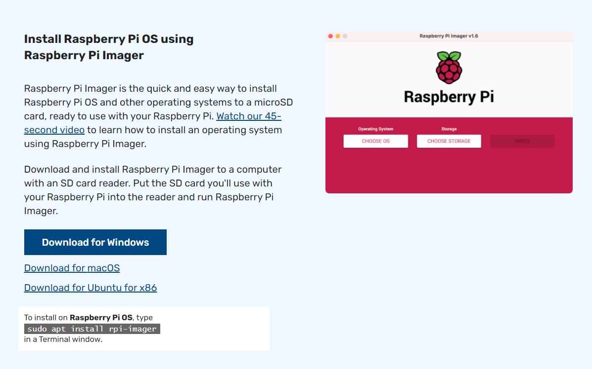

インストーラーを実行して、手順通りに進めていく

## Raspberry Pi Imager でメージの書き込む

1. Raspberry Pi Imager を起動する

   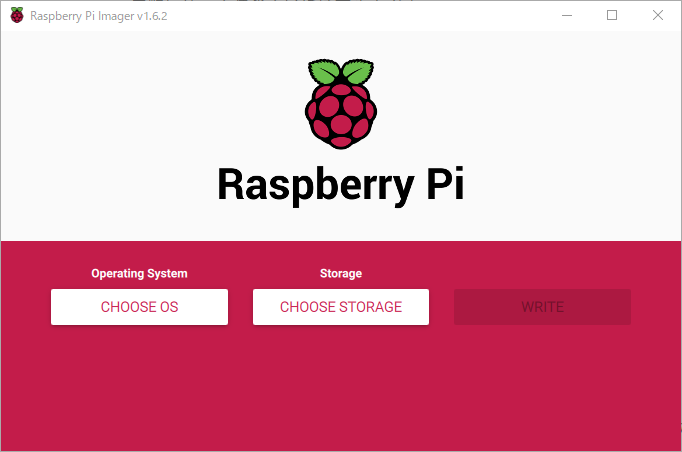

2. [CHOOSE OS] をクリックする

   以下のように OS の一覧が表示される

   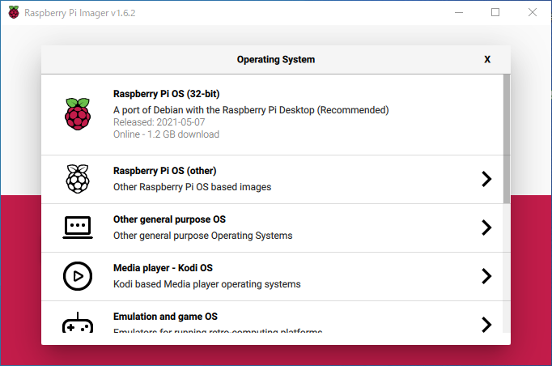

   今回は、ダウンロードして OS イメージを書き込むので、[Use custom] をクリックする

   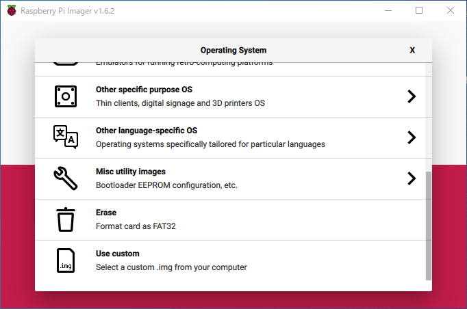

   ダウンロードした 64bit Raspberry Pi OS with desktop のイメージファイルを選択する

   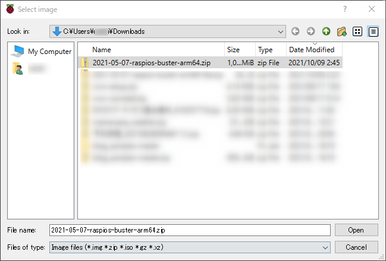

   最初の画面に戻ると、選択した OS が表示される

   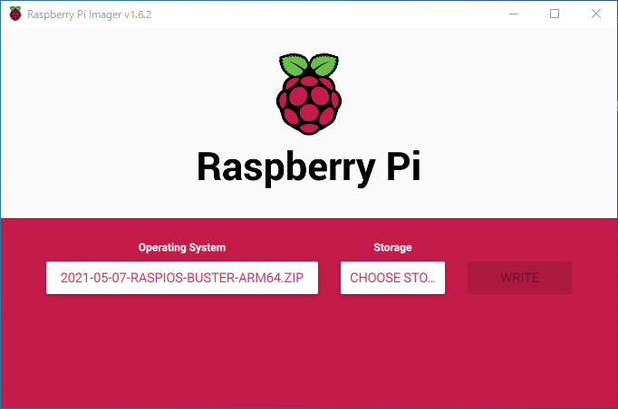

3. [CHOOSE SD CARD] をクリックする

   インストール先の SD カードを選択する

   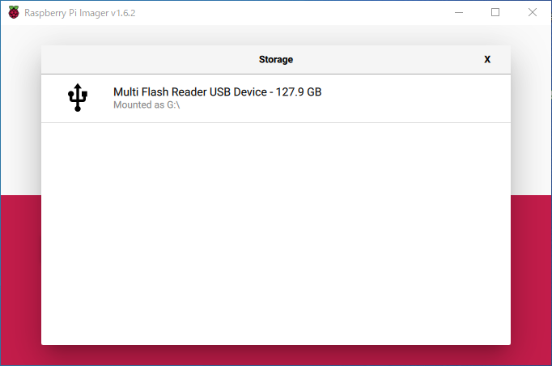

   最初の画面に戻ると、選択した SD カードが表示される

   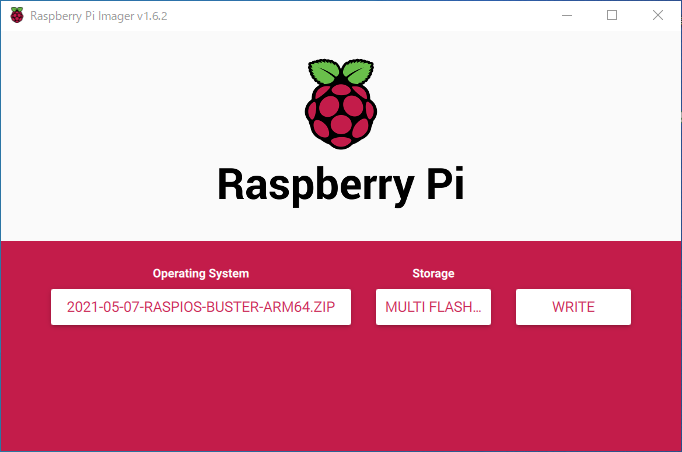

4. [WRITE] をクリックする

   SD カードのデータが削除されますが、続けますかと聞かれるので、
   問題なければ、[YES] をクリックする

   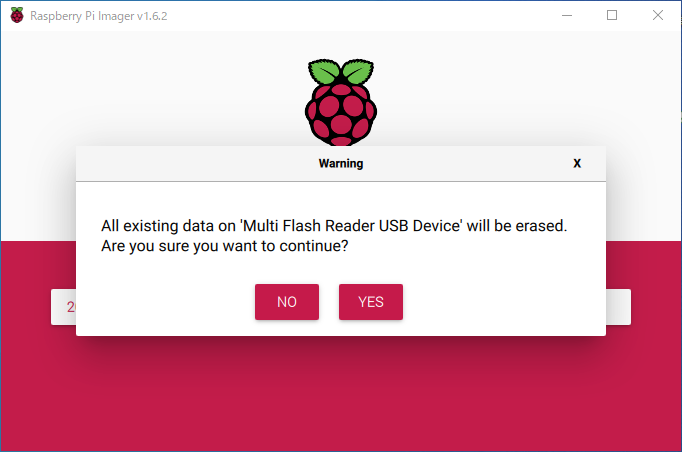

   書き込み中...

   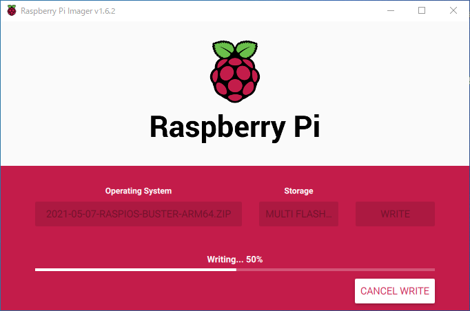

   完了すると、下記のような画面が表示される

   [CONTINUE] をクリックして、SD カードを取り出す

   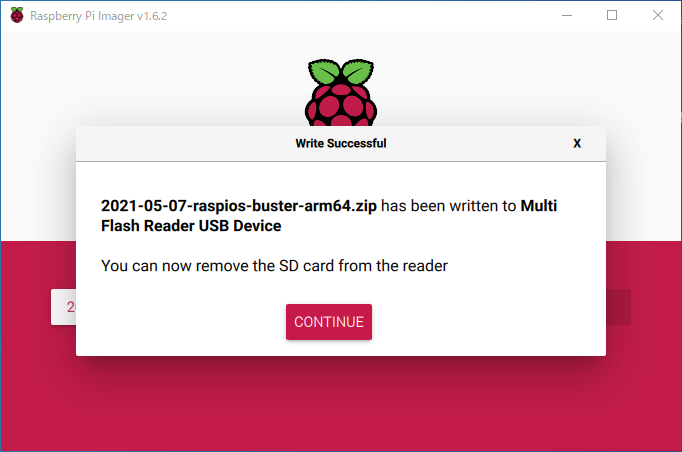
