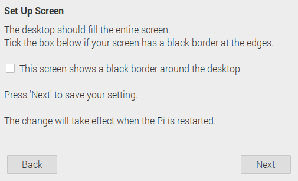
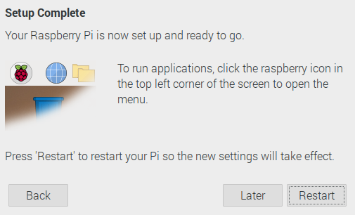

# Raspberry Pi OS のセットアップ

## 目次

- [Raspberry Pi OS の OS イメージを作成](01_install.md)
- Raspberry Pi OS のセットアップ
- [Raspberry Pi にリモートから接続する](03_remote.md)
- [Raspberry Pi 4 Model B のファームウェアをアップデート](04_firmware.md)
- [Raspberry Pi OS でスクリーンショットを撮る](99_screenshot.md)

## 事前準備

[Raspberry Pi OS の OS イメージを作成](install.md) で Raspberry Pi OS イメージを作成しておく

## セットアップ

1. Raspberry Pi OS イメージが入った SD カードを、RaspberryPi 本体にカードを差し込み、電源を入れて起動する

   

2. 「Welcome to the Raspberry Pi Desktop!」と表示されるので [Next] をクリックして、次に進む

   

3. [Country] で、[Japan] を探し、選択すると、[Language] が [Japanease] になり、[Timezone] が [Tokyo] に指定されるので、[Next] をクリックする

   

4. 「pi」ユーザーのパスワードを設定し、[Next]をクリックする

   

5. デスクトップの周囲に黒い枠がある場合は、チェックボックスを選択する

   [Next]をクリックして、次に進む

   

6. 検出されたアクセスポイント SSID を選択して、[Next]をクリックする

   

7. アクセスポイントのパスワードを入力して、[Next]をクリックする

   

8. 今回は、ソフトウェアを最新に更新したいので、[Next]をクリックする

   

9. 更新中...

   

10. ソフトウェアの更新中が完了！

    

11. Raspberry Pi OS のセットアップが完了！！

    [Restarr] をクリックして、再起動する

    

## 日本語環境の準備

`ibus-mozc` パッケージをインストールする

```sh
pi@raspberrypi:~ $ sudo apt install ibus-mozc
```

再起動させると日本語の入力が可能になる
