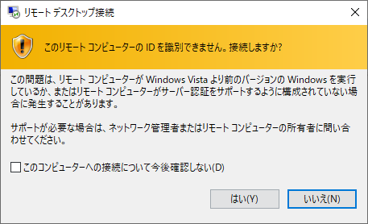

# Raspberry Pi にリモートから接続する

## 目次

- [Raspberry Pi OS の OS イメージを作成](01_install.md)
- [Raspberry Pi OS のセットアップ](02_setup.md)
- Raspberry Pi にリモートから接続する
- [Raspberry Pi 4 Model B のファームウェアをアップデート](04_firmware.md)
- [Raspberry Pi OS でスクリーンショットを撮る](99_screenshot.md)

## SSH でリモート接続

### SSH の有効化 (CUI で有効化する場合)

1. ssh をサービス起動デーモンとして有効化する

   ```sh
   sudo systemctl enable ssh
   ```

1. ssh サービスを起動する

   ```sh
   sudo systemctl start ssh
   ```

### SSH の有効化 (GUI で有効化する場合)

1. Raspberry Pi Software Configuration Tool を起動する

   ```sh
   sudo raspi-config
   ```

   

1. [Interfacing Options] を選択する

   

1. [P2 SSH] を選択する

   

1. [はい] を選択する

   

1. [了解] を選択する

   

1. [Finish] を選択する

   

### 接続確認


## VNC でリモート接続

### VNC の有効化 (CUI で有効化する場合)

1. vncserver をサービス起動デーモンとして有効化する

   ```sh
   sudo systemctl enable vncserver-x11-serviced
   ```

1. ssh サービスを起動する

   ```sh
   sudo systemctl start ssh
   ```

### VNC の有効化 (GUI で有効化する場合)

1. Raspberry Pi Software Configuration Tool を起動する

   ```sh
   sudo raspi-config
   ```

   

1. [Interfacing Options] を選択する

   

1. [P3 VNC] を選択する

   

1. [はい] を選択する

   

1. [了解] を選択する

   

1. [Finish] を選択する

   

### 接続確認

1. [VNC Viewer](https://www.realvnc.com/en/connect/download/viewer/) をダウンロードして、起動する

   初回起動時は以下のような画面が表示されます。使用統計データを送りたくない場合は「Send anonymous usage data to help improve VNC Viewer」のチェックを外す

   「GOT IT」をクリックして画面を閉じる

   

1. Raspberry Pi の IP アドレスを入力して、Enter を押下する

   

1. 初めて接続するデバイスに関しては警告がでるので、[Continue] をクリックする

   

1. 接続情報を入力して、[OK] をクリックする

   - [Username] : pi
   - [Password] : 設定したパスワード

     

1. Raspberry Pi OS の画面が表示された

   

## RDP(Remote Desktop Protocol) でリモート接続

1. xrdp パッケージをインストールする

   ```sh
   sudo apt-get install xrdp
   ```

1. xrdp サービスを起動する

   ```sh
   sudo service xrdp restart
   ```

1. 接続確認

   リモートデスクトップを開いて、Raspberry Pi の IP アドレスを入力する

   

   [はい] をクリックする

   

   接続情報を入力して、[OK] をクリックする

   - [Session] : Xorg
   - [username] : pi
   - [password] : 設定したパスワード

   

   Raspberry Pi OS の画面が表示された

   

## X Window System でリモート接続

1. [VcXsrv](https://sourceforge.net/projects/vcxsrv/) をインストールする

   [Next] をクリックする

   

   [Install] をクリックする

   

2. XLaunch を起動する

   デフォルトの選択肢のまま [次へ] をクリックする

   

   デフォルトの選択肢のまま [次へ] をクリックする

   

   デフォルトでチェックが外れている[Disable access control] にチェックをつけて、[次へ] をクリックする

   

   Disable access control のチェックが外れたままだと、GUI のアプリケーションを起動する時にエラーメッセージが表示される

   

   [完了]をクリックする

   

3. XLaunch が起動したら、Windows Defender ファイアウォールの警告が表れるので、  
   「プライベート ネットワーク (ホームネットワークや社内ネットワークなど)」のみを  
   許可する

   

4. Raspberry Pi に SSH でログインする

5. DISPLAY 環境変数の設定する

   「xxx.xxx.xxx.xxx」に XLaunch が実行されているマシンの IP アドレスを指定する

   ```sh
   pi@raspberrypi:~ $export DISPLAY=xxx.xxx.xxx.xxx:0.0
   ```

6. 疎通確認

   ```sh
   pi@raspberrypi:~ $ xeyes
   ```

   お目目さんが表示されれば、ok

   
