# Raspberry Pi 4 Model B のファームウェアをアップデート

## 目次

- [Raspberry Pi OS の OS イメージを作成](01_install.md)
- [Raspberry Pi OS のセットアップ](02_setup.md)
- [Raspberry Pi にリモートから接続する](03_remote.md)
- Raspberry Pi 4 Model B のファームウェアをアップデート
- [Raspberry Pi OS でスクリーンショットを撮る](99_screenshot.md)

1. 事前にシステムを最新状態にする
   ファームウェアのアップデート前に、パッケージ一覧の更新とパッケージの更新を行う

   ```sh
   $ sudo apt update
   $ sudo apt full-upgrade
   $ shutdown -r 0
   ```

   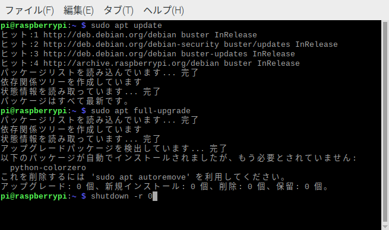

1. ファームウェアのバージョン確認

   ```sh
   $ rpi-eeprom-update
   ```

   以下のように CURRENT と LATEST が一致して場合は最新のファームウェアなので更新は不要

   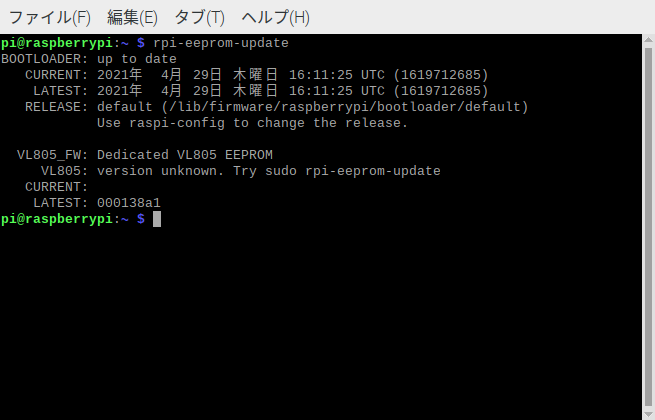

1. raspi-config でファームウェアのアップデート

   URRENT と LATEST が異なる場合は、ファームウェアのアップデートを行う

   raspi-config コマンドを実行すると「Raspberry Pi Software Configuration Tool (raspi-config)」画面が表示さる

   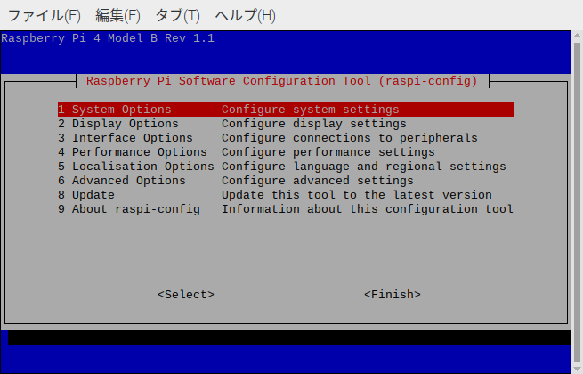

   [6 Advanced Options] を選択する

   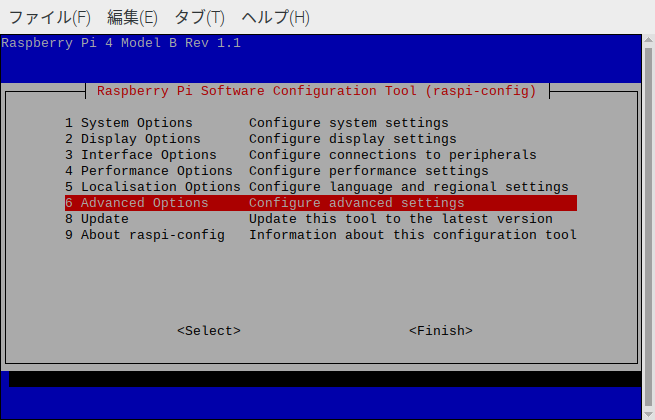

   [A7 Bootloader Version] を選択する

   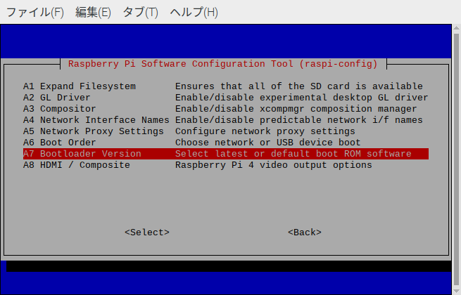

   [E1 Latest] を選択する

   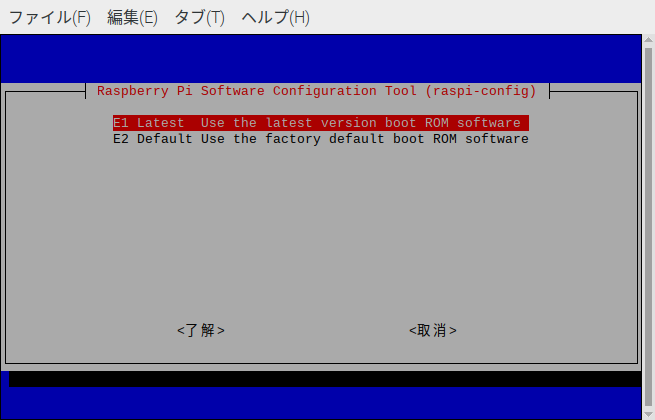

   [Reset boot ROM to defaults?] と表示されたら [はい] を選択する

   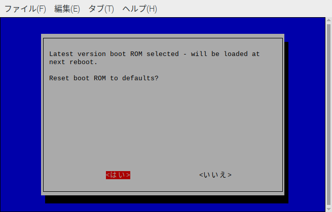

   [Boot ROM reset to defaults] と表示されたら [了解] を選択する

   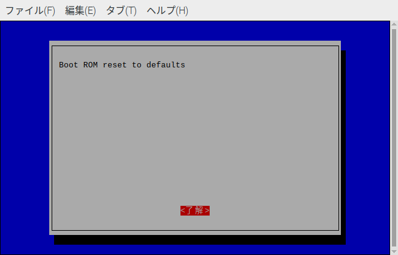

   最初の画面に戻ったら、[Finish] を選択する

   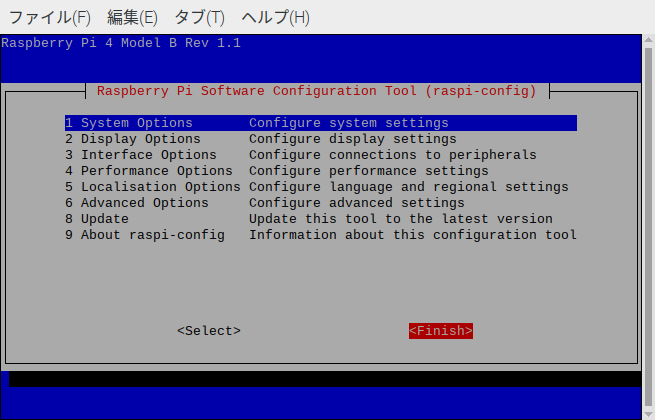

   [Would you like to reboot now?] と表示されたら [はい] を選択する

   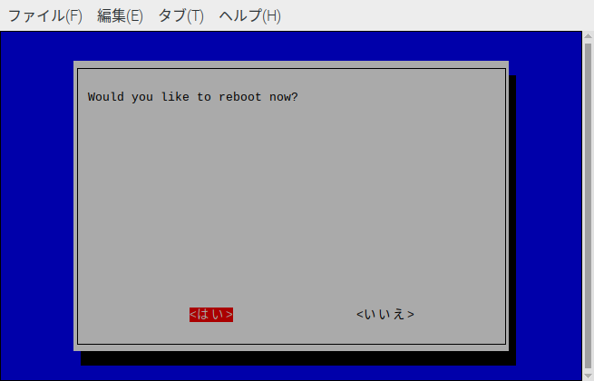

   `rpi-eeprom-update` コマンドを実行して、CURRENT と LATEST が同じ内容になっていたらファームウェアが適用されている

   

1. 補足

   ファームウェアには `critical` / `stable` / `beta` の 3 種類があり、 初期設定では `stable` が選択されている
   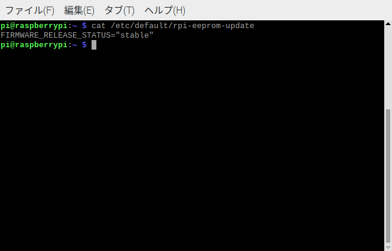

   ファームウェアのバージョンは以下のコマンドで確認できる

   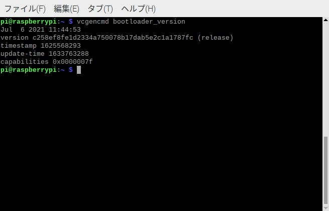
