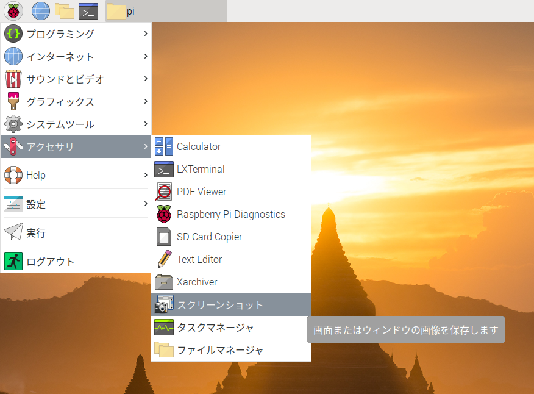
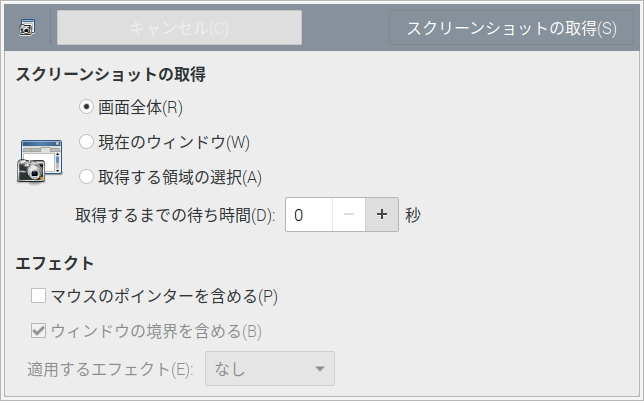

# Raspberry Pi OS でスクリーンショットを撮る

## 目次

- [Raspberry Pi OS の OS イメージを作成](01_install.md)
- [Raspberry Pi OS のセットアップ](02_setup.md)
- [Raspberry Pi にリモートから接続する](03_remote.md)
- [Raspberry Pi 4 Model B のファームウェアをアップデート](04_firmware.md)
- Raspberry Pi OS でスクリーンショットを撮る

Raspberry Pi OS には「scrot」と呼ばれるスクリーンショットを撮るアプリケーションがインストールされている

- 「Print Screen」キーを押すことでスクリーンショットを撮るように設定されている
- スクリーンショットは「/home/pi」に PNG 形式で保存される
- スクリーンショットのファイル名は `YYYY-MM-DD-HHmmss_縦横サイズ_scrot.png`

## コマンドによる操作

1. 基本的な使い方

   ```sh
   $ scrot [保存するファイル名]
   ```

   | オプション | 説明                                     |
   | ---------- | ---------------------------------------- |
   | なし       | 全画面をキャプチャ                       |
   | -u         | アクティブウィンドウをキャプチャ         |
   | -s         | 選択領域をキャプチャ                     |
   | -b         | ウィンドウタイトルバーを含めてキャプチャ |
   | -c         | カウント                                 |

1. 全デスクトップ画面のスクリーンショットを撮る

   「Print Screen」キーと同じ

   ```sh
   pi@raspberrypi:~ $ scrot
   ```

1. ファイル名を指定する

   カレントディレクトリに保存される。

   他の場所に保存した場合は、パスを指定することもできる

   ```sh
   pi@raspberrypi:~ $ scrot hoge.png
   ```

1. 遅延によるスクリーンショットを撮る

   「`-d` オプション 秒数」 で指定する

   以下は、10 秒後にスクリーンショットを撮る

   ```sh
   pi@raspberrypi:~ $ scrot -d 10
   ```

   遅延を使う場合、`-c` オプションを付けると、キャプチャまでのカウントダウンが表示される

   ```sh
   pi@raspberrypi:~ $ scrot -d 10 -c
   Taking shot in 10.. 9.. 8.. 7.. 6.. 5.. 4.. 3.. 2.. 1.. 0.
   ```

1. アクティブウィンドウのスクリーンショットを撮る

   アクティブなウィンドウのみを撮影するには `-u` オプションを付ける

   ```sh
   pi@raspberrypi:~ $ scrot -u
   ```

   以下は、10 秒後にアクティブウィンドウを撮る

   ```sh
   pi@raspberrypi:~ $ scrot -u -d 10
   ```

1. 指定領域のスクリーンショットを撮る

   `-s` オプション を指定して、scrot を起動すると選択領域をキャプチャする

   ```sh
   pi@raspberrypi:~ $ scrot -s
   ```

   - デスクトップの背景をクリックすると、全画面をキャプチャする
   - 任意のウィンドウをクリックすると、そのウィンドウをキャプチャする
   - マウスをドラックして範囲指定すると、その矩形領域をキャプチャする

1. ウィンドウタイトルを含めてキャプチャする

   `-b` オプションを指定すると、タイトルバーを含めてキャプチャする

   アクティブウィンドウをタイトルバーも含めてキャプチャする

   ```sh
   pi@raspberrypi:~ $ scrot -ub
   ```

   クリックしたウィンドウのタイトルバーも含めてキャプチャする

   ```sh
   pi@raspberrypi:~ $ scrot -sb
   ```

1. SSH 接続でスクリーンショットを撮る

   事前に、スクシュを撮りたい画面のディスプレイ番号とスクリーン番号を取得する

   ```sh
   pi@raspberrypi:~ $ echo $DISPLAY
   :10.0
   ```

   SSH で Raspberry Pi に接続し、環境変数 DISPLAY を設定する

   ```sh
   pi@raspberrypi:~ $ export DISPLAY=:10.0
   ```

   スクシュを撮る

   ```sh
   pi@raspberrypi:~ $ scrot
   ```

1. GUI 操作でスクリーンショットを撮る

   gnome-screenshot をインストールする

   ```sh
   pi@raspberrypi:~ $ sudo apt install gnome-screenshot
   ```

   [アクセサリ] > [スクリーンショット] から起動できる

   

   
