## git for windows インストール

### 事前準備

1. [WinMerge](https://winmerge.org/?lang=ja) をインストールする

1. [サクラエディタ](https://sakura-editor.github.io/) をインストールする

### git for windows インストール

1. [git for windows](https://gitforwindows.org/) インストール をダウンロードする

1. インストーラーを実行する

1. ライセンスの確認

    同意して [Next] を クリックする

    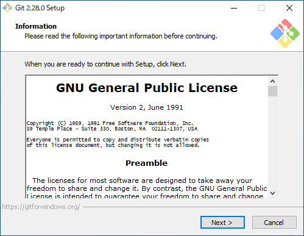

1. インストールフォルダの指定

    デフォルトのままで。 [Next] を クリックする

    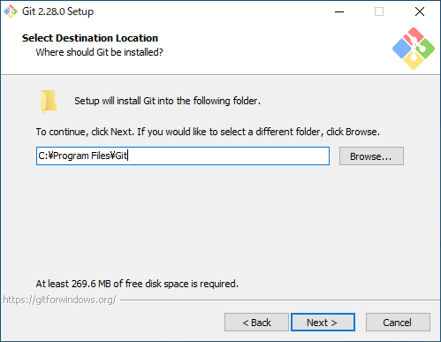

1. コンポートネットを選択

    * Additioncal icons

        - On the Desktop

            ディスクトップにアイコンを追加する

    * Windows Explorer integration

        - Git Bash Here

            エクスプローラーのコンテキストメニューに `Git Bash Here` 追加する

        - Git GUI Here

            エクスプローラーのコンテキストメニューに `Git GUI Here` 追加する

    * Git LFS(Large File Support)

        Git LFSのサポート有無。

    * Associate .git* configuration files with the default text editor
    
        `.git` コンフィグレーション・ファイルとデフォルトのテキストエディタを関連付ける

    * Associate .sh files to be run with Bash
    
        `*.sh` ファイルをBashで実行するように関連付ける

    * Use a TrueType font in all console windows
    
        全てのコンソールウインドウにTrueTypeフォントを使用する

    * Check daily for Git Windows updates
    
        `Git for Windows` のアップデートを確認する

    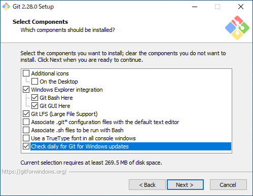

1. メニューフォルダーを選択

    デフォルトのままで。 [Next] を クリックする

    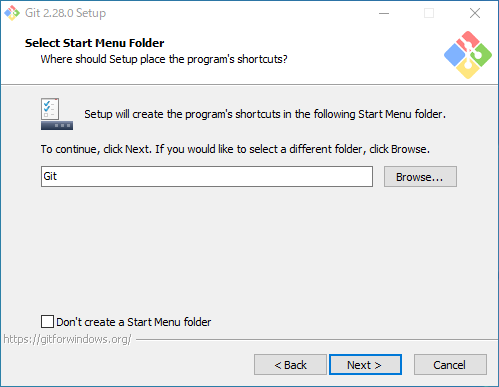

1. デフォルトのエディタを設定

    * Use Vim(the ubiquitous text editor) as Git’s default editor
    
        [Vim](https://www.vim.org/) をデフォルで使用する

    * Use Notepad++ as Git’s default editor

        [Notepad++](https://notepad-plus-plus.org/) をデフォルで使用する。

    * Use Visual Studio Code as Git’s default editor
    
        [Visual Studio Code](https://code.visualstudio.com) のエディタを使用する。

    * Use Visual Studio Code Insiders as Git’s default editor
    
        [Visual Studio Code Insiders版](https://code.visualstudio.com/insiders/) のエディタを使用する。

    * Use Sublime Text as Git’s default editor
    
        [Sublime Text](https://www.sublimetext.com/) エディタをデフォルで使用する

    * Use Atom as Git’s default editor
    
        [Atom](https://atom.io/) エディタをデフォルで使用する

    * Use VSCodium as Git’s default editor
    
        [VSCodium](https://vscodium.com/) エディタをデフォルで使用する

    * Select other editor as Git’s default editor

        上記以外のエディタをデフォルで使用する

    ここでは、サクラエディタをデフォルトのエディタとして設定して、[Next] を クリックする

    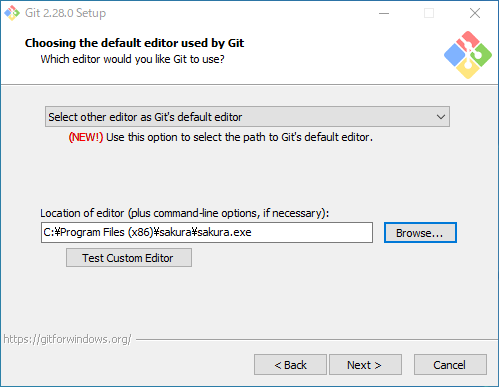

1. 環境変数 `PATH` 設定

    * Use Git from Git Bash only
    
        `Git Bash` のみ `git` コマンドが使える。
        
        環境変数 `PATH` には追加しない。

    * Use Git from the Windows Command Prompt
    
        コマンドプロンプトから `git` コマンドが使える。

        環境変数 `PATH` に     

        + `C:\Program Files\Git\cmd`

        が追加される

    * Use Git and optional Unix tools from the Windows Command Prompt
    
        コマンドプロンプトから `git` コマンドと `Unix` コマンドが使える

        環境変数 `PATH` に

        + `C:\Program Files\Git\cmd`
        + `C:\Program Files\Git\mingw64\bin`
        + `C:\Program Files\Git\usr\bin`

        が追加される

    ここでは、`Use Git from Git Bash only` を選択して、[Next] を クリックする

    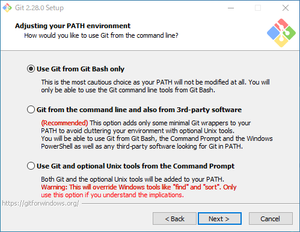

1. HTTPS (SSL)通信のバックエンドを選択

    * Use the OpenSSL library
    
        Git for Windows (の中のMSYS2) に含まれている OpenSSL ライブラリを利用する

        ルート証明書は、
        
        + `C:/Program Files/Git/mingw64/ssl/certs/ca-bundle.crt`
        
        が使用される

    * Use the native Widows Secure Channel library
    
        Windows 標準の SSLライブラリを利用する

        ルート証明書は
        
        + `Windows Certificate Store(certmgr.msc)`
        
        が使用される

    ここでは、デフォルトで選択されている「Use the OpenSSL library」を選択して、[Next] を クリックする

    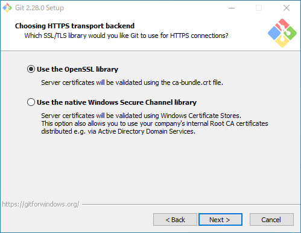

1. 改行コードの自動変換を選択

    * Checkout Windows-style, commit Unix-style line endings
    
        + テキストファイルのチェックアウト時、改行コード `LF` を `CRLF` に変換する
        + テキストファイルのコミット時、改行コード `CRLF` を `LF` に変換する
        + Windowsに対して推薦される設定である
        + `autocrlf` が `true` に設定される

    * Checkout as-is, commit Unix-style line endings
    
        + テキストファイルのチェックアウト時、改行コードの変換は行わない
        + テキストファイルのコミット時、改行コード `CRLF` を `LF` に変換する
        + Unix環境に対して推薦される設定である
        + `autocrlf` が `input` に設定される

    * Checkout as-is, commit as-is
    
        + テキストファイルのチェックアウト時、改行コードの変換は行わない
        + テキストファイルをのコミット時、改行コードの変換は行わない
        + `autocrlf` が `false` に設定される

    ここでは、勝手に改行コードを変換されたくないので、`Checkout as-is, commit as-is` を選択して、[Next] を クリックする

    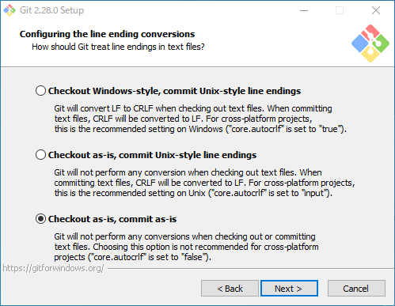

1. Git Bash で使うターミナルエミュレータの設定

    * Use MinTTY(the default terminal of MSYS2)

        `Git Bash` は [MinTTY](Mintty — Cygwin Terminal emulator)をターミナル・エミュレータとして使用する

    * Use Widow’s default console windows
    
        `Git Bash` は Windows のコマンドプロンプトを使用する

    ここでは、デフォルトの `Use MinTTY(the default terminal of MSYS2)` を選択して、[Next] を クリックする

    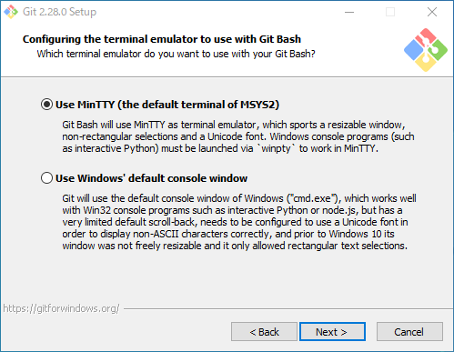

1. `git pull` のデフォルトの動作設定

    * Default (fast-forward or merge)

        + pull したとき、fast-forward が可能ならば、fast-forward commit
         または merge commit を作成して、ローカルブランチにマージする
        + `git config pull.rebase false`
        + `git pull --ff` が実行される

    * Rebase

        + pull したとき、rebaseで、ローカルブランチにマージする
        + `git config pull.rebase true`
        + `git pull --rebase` が実行される

    * Only ever fast-forward

        + pull したとき、fast-forward のみで、ローカルブランチにマージする
        + `git config pull.ff only`
        + `git pull --ff-only` が実行される

    ここでは、デフォルトの `Default (fast-forward or merge)` を選択して、[Next] を クリックする

    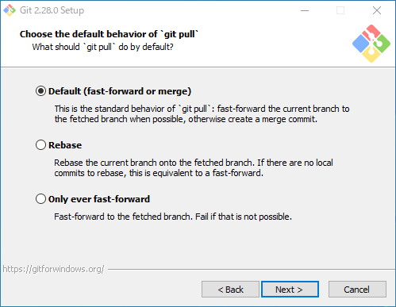

1. 認証情報の保存

    * None
    
        + 認証情報の保存は行わない

    * Git Credential Manager

        + [Git Credential Manager for Windows](https://github.com/Microsoft/Git-Credential-Manager-for-Windows) を利用して認証情報を保存する

    * Git Credential Manager Core

        + [Git Credential Manager Core](https://github.com/microsoft/Git-Credential-Manager-Core) を利用して認証情報を保存する

    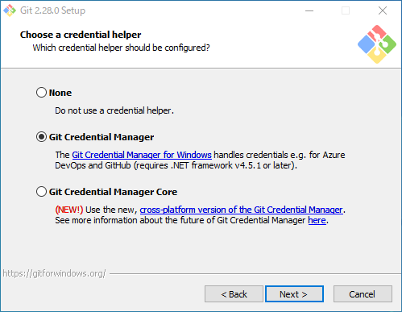

1. 追加オプション設定

    * Enable file system caching
    
        + ファイル・システムのキャッシュを有効にする
        + `fscache` が `true` に設定される
        + 大幅なパフォーマンス向上する
        + git config --global core.fscache true

    * Enable symbolic links
    
        + シンボリック・リンクを有効にする
        + `SeCreateSymbolicLink` 許可が要求される

    ここでは `Enable file system caching`を選択して、[Next] を クリックする

    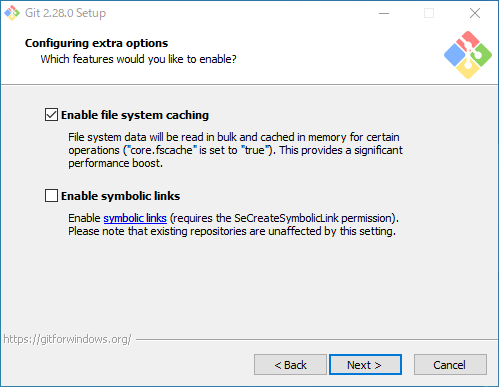

1. 試験運用オプション

    + Enable experimental support for pseudo consoles

        Git Bash window 上で Python や Node のコンソールプログラムが動作するようになる

    ここでは 選択せずに、[Next] を クリックする

    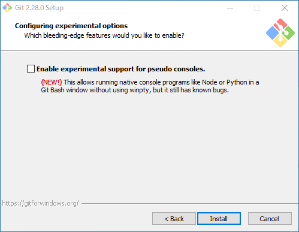

1. インストール中...

    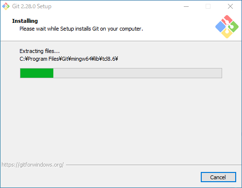

1. インストール完了。[Next] を クリックしてお疲れ様でした！

    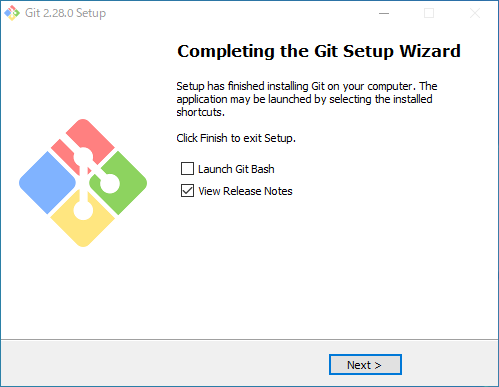
