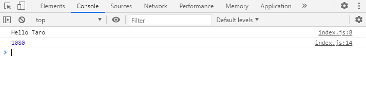

# webpack  

## 環境

* Ubuntu 18.04
* node v14.15.1
* npm 6.14.8

## 事前準備

* nodejs と npm をインストール

    [anyenv の導入](anyenv/Readme.md) を参考に `node` と `npm` をインストールする
    
    ※ `Ubuntu 18.04` で `apt` コマンドでインストールするとかなり古いバージョンがインストールされるため
    ```
    $ anyenv install nodenv
    $ exec $SHELL
    $ nodenv install 14.15.1
    $ nodenv rehash
    ```

* プロジェクトディレクトリの作成
    ```
    $ mkdir sample-app
    $ npm init -y
    ```

* webpack のインストール

    ```
    $ npm install webpack webpack-cli --save-dev
    $ npx webpack --version

    webpack-cli 4.2.0

    webpack 5.6.0
    ```

## ファイルを準備

* ディレクトリ構成

    ```
    /
    ├── package.json
    ├── public
    │   ├── index.html
    │   └── js
    │       └── bundle.js
    ├── src
    │   └── js
    │       ├── index.js
    │       └── modules
    │           ├── hello.js
    │           └── tax.js
    ├── webserver
    │   └── server.js
    │
    └── webpack.config.js
    ```

* webpack.config.js

    ```JavaScript
    const path = require('path');

    module.exports = {
        // モード( development/production/none )
        mode: 'development',
        // エントリーポイント
        entry: './src/js/index.js',
        // 出力先
        output: {
            // 出力ファイル名
            filename: 'bundle.js',
            // 出力ディレクトリ名
            path: path.join(__dirname, 'public/js')
        }
    }
    ```

* index.js

    ```JavaScript
    import hello from './modules/hello';
    import tax from './modules/tax';

    var msg = hello('Taro');
    console.log(msg);

    const TAX = 1.08;
    var price = 1000;
    var priceIncludeTax = tax(price, TAX);

    console.log(priceIncludeTax);
    ```

* hello.js

    ```JavaScript
    export default function(name) {
        return `Hello ${name}`;
    }
    ```

* tax.js

    ```JavaScript
    export default function tax(price ,tax) {
        return Math.round(price * tax);
    }
    ```

* index.html

    ```html
    <html>
    <head>
        <meta charset="utf-8">
        <title>Hello webpack</title>
    </head>

    <body>
        <script src="js/bundle.js"></script>
    </body>

    </html>
    ```

* server.js

    [簡易 Web サーバーを作ってみる](webserver.md) を参考に、簡易 Webサーバーを作る

    ```JavaScript
    'use strict';

    const express = require('express');
    const app = express();

    app.use(express.static('./public'));
    app.listen(8001, ()=> {
        console.log('Start Server');
    });
    ```

## `webpack` を実行する

* `webpack` コマンドを実行して、モジュールをバンドルする

    ```console
    $ npx webpack
    [webpack-cli] Compilation finished
    asset bundle.js 5.81 KiB [compared for emit] (name: main)
    runtime modules 668 bytes 3 modules
    cacheable modules 361 bytes
      ./src/js/index.js 221 bytes [built] [code generated]
      ./src/js/modules/hello.js 62 bytes [built] [code generated]
      ./src/js/modules/tax.js 78 bytes [built] [code generated]
    webpack 5.9.0 compiled successfully in 78 ms
    ```

* 出力された `bundle.js` を確認

    ```JavaScript
    /*
     * ATTENTION: The "eval" devtool has been used (maybe by default in mode: "development").
     * This devtool is not neither made for production nor for readable output files.
     * It uses "eval()" calls to create a separate source file in the browser devtools.
     * If you are trying to read the output file, select a different devtool (https://webpack.js.org/configuration/devtool/)
     * or disable the default devtool with "devtool: false".
     * If you are looking for production-ready output files, see mode: "production" (https://webpack.js.org/configuration/mode/).
     */
    /******/ (() => { // webpackBootstrap
    /******/        "use strict";
    /******/        var __webpack_modules__ = ({

    /***/ "./src/js/index.js":
    /*!*************************!*\
      !*** ./src/js/index.js ***!
      \*************************/
    /*! namespace exports */
    /*! exports [not provided] [no usage info] */
    /*! runtime requirements: __webpack_require__, __webpack_require__.r, __webpack_exports__, __webpack_require__.* */
    /***/ ((__unused_webpack_module, __webpack_exports__, __webpack_require__) => {

    eval("__webpack_require__.r(__webpack_exports__);\n/* harmony import */ var _modules_hello__WEBPACK_IMPORTED_MODULE_0__ = __webpack_require__(/*! ./modules/hello */ \"./src/js/modules/hello.js\");\n/* harmony import */ var _modules_tax__WEBPACK_IMPORTED_MODULE_1__ = __webpack_require__(/*! ./modules/tax */ \"./src/js/modules/tax.js\");\n\n\n\nvar msg = (0,_modules_hello__WEBPACK_IMPORTED_MODULE_0__.default)('Taro');\nconsole.log(msg);\n\nconst TAX = 1.08;\nvar price = 1000;\nvar priceIncludeTax = (0,_modules_tax__WEBPACK_IMPORTED_MODULE_1__.default)(price, TAX);\n\nconsole.log(priceIncludeTax);\n\n\n//# sourceURL=webpack://sample-app3/./src/js/index.js?");

    /***/ }),

    /***/ "./src/js/modules/hello.js":
    /*!*********************************!*\
      !*** ./src/js/modules/hello.js ***!
      \*********************************/
    /*! namespace exports */
    /*! export default [provided] [no usage info] [missing usage info prevents renaming] */
    /*! other exports [not provided] [no usage info] */
    /*! runtime requirements: __webpack_require__.r, __webpack_exports__, __webpack_require__.d, __webpack_require__.* */
    /***/ ((__unused_webpack_module, __webpack_exports__, __webpack_require__) => {

    eval("__webpack_require__.r(__webpack_exports__);\n/* harmony export */ __webpack_require__.d(__webpack_exports__, {\n/* harmony export */   \"default\": () => /* export default binding */ __WEBPACK_DEFAULT_EXPORT__\n/* harmony export */ });\n/* harmony default export */ function __WEBPACK_DEFAULT_EXPORT__(name) {\n    return `Hello ${name}`;\n}\n\n\n//# sourceURL=webpack://sample-app3/./src/js/modules/hello.js?");

    /***/ }),

    /***/ "./src/js/modules/tax.js":
    /*!*******************************!*\
      !*** ./src/js/modules/tax.js ***!
      \*******************************/
    /*! namespace exports */
    /*! export default [provided] [no usage info] [missing usage info prevents renaming] */
    /*! other exports [not provided] [no usage info] */
    /*! runtime requirements: __webpack_require__.r, __webpack_exports__, __webpack_require__.d, __webpack_require__.* */
    /***/ ((__unused_webpack_module, __webpack_exports__, __webpack_require__) => {

    eval("__webpack_require__.r(__webpack_exports__);\n/* harmony export */ __webpack_require__.d(__webpack_exports__, {\n/* harmony export */   \"default\": () => /* binding */ tax\n/* harmony export */ });\nfunction tax(price ,tax) {\n  return Math.round(price * tax);\n}\n\n\n//# sourceURL=webpack://sample-app3/./src/js/modules/tax.js?");

    /***/ })

    /******/        });
    /************************************************************************/
    /******/        // The module cache
    /******/        var __webpack_module_cache__ = {};
    /******/
    /******/        // The require function
    /******/        function __webpack_require__(moduleId) {
    /******/                // Check if module is in cache
    /******/                if(__webpack_module_cache__[moduleId]) {
    /******/                        return __webpack_module_cache__[moduleId].exports;
    /******/                }
    /******/                // Create a new module (and put it into the cache)
    /******/                var module = __webpack_module_cache__[moduleId] = {
    /******/                        // no module.id needed
    /******/                        // no module.loaded needed
    /******/                        exports: {}
    /******/                };
    /******/
    /******/                // Execute the module function
    /******/                __webpack_modules__[moduleId](module, module.exports, __webpack_require__);
    /******/
    /******/                // Return the exports of the module
    /******/                return module.exports;
    /******/        }
    /******/
    /************************************************************************/
    /******/        /* webpack/runtime/define property getters */
    /******/        (() => {
    /******/                // define getter functions for harmony exports
    /******/                __webpack_require__.d = (exports, definition) => {
    /******/                        for(var key in definition) {
    /******/                                if(__webpack_require__.o(definition, key) && !__webpack_require__.o(exports, key)) {
    /******/                                        Object.defineProperty(exports, key, { enumerable: true, get: definition[key] });
    /******/                                }
    /******/                        }
    /******/                };
    /******/        })();
    /******/
    /******/        /* webpack/runtime/hasOwnProperty shorthand */
    /******/        (() => {
    /******/                __webpack_require__.o = (obj, prop) => Object.prototype.hasOwnProperty.call(obj, prop)
    /******/        })();
    /******/
    /******/        /* webpack/runtime/make namespace object */
    /******/        (() => {
    /******/                // define __esModule on exports
    /******/                __webpack_require__.r = (exports) => {
    /******/                        if(typeof Symbol !== 'undefined' && Symbol.toStringTag) {
    /******/                                Object.defineProperty(exports, Symbol.toStringTag, { value: 'Module' });
    /******/                        }
    /******/                        Object.defineProperty(exports, '__esModule', { value: true });
    /******/                };
    /******/        })();
    /******/
    /************************************************************************/
    /******/        // startup
    /******/        // Load entry module
    /******/        __webpack_require__("./src/js/index.js");
    /******/        // This entry module used 'exports' so it can't be inlined
    /******/ })()
    ;
    ```

## 簡易 Web サーバーを起動し、ブラウザからアクセスする

1. Web サーバーを起動
    ```console
    $ node webserver/server.js
    Start Server
    ```

1. ブラウザを開く

1. 開発ツールを開く

1. ブラウザからアクセスする

    http://localhost:8001/index.html

    動作することが確認できる
    

## 外部モジュールも一緒にバンドルしてみる

* `jquery` をインストールする

    ```
    $ npm install jquery --save
    ```

* index.js ファイルを編集する

    index.js
    ```JavaScript
    import $ from 'jquery';
    import hello from './modules/hello';
    import tax from './modules/tax';

    var msg = hello('Taro');
    console.log(msg);

    const TAX = 1.08;
    var price = 1000;
    var priceIncludeTax = tax(price, TAX);

    console.log(priceIncludeTax);

    var $ele1 = $('<p />').text(msg);
    var $ele2 = $('<p />').text(priceIncludeTax);
    $('body').append($ele1);
    $('body').append($ele2);
    ```

* `webpack` コマンドを実行すると、`jquery` もバンドルされたファイルが出力される

    ```console
    $ npx webpack
    [webpack-cli] Compilation finished
    asset bundle.js 325 KiB [emitted] (name: main)
    runtime modules 931 bytes 4 modules
    cacheable modules 281 KiB
      modules by path ./src/js/modules/*.js 140 bytes
        ./src/js/modules/hello.js 62 bytes [built] [code generated]
        ./src/js/modules/tax.js 78 bytes [built] [code generated]
      ./src/js/index.js 376 bytes [built] [code generated]
      ./node_modules/jquery/dist/jquery.js 281 KiB [built] [code generated]
    webpack 5.9.0 compiled successfully in 238 ms
    ```

1. ブラウザからアクセスする

    http://localhost:8001/index.html

    動作することが確認できる

    
