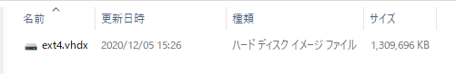
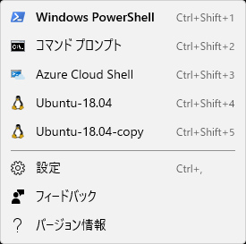
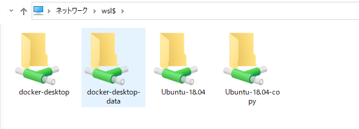
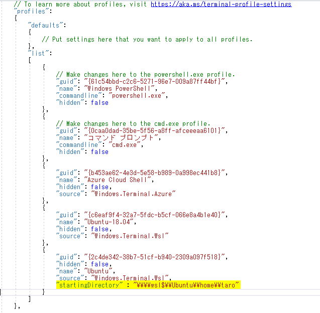

# WSL上の 手動でディストリビューションをインポートする

## インストールされているディストリビューションを複製する

1. インストールされているディストリビューションを確認

    ```console
    >wsl -l -v
      NAME                   STATE           VERSION
    * Ubuntu-18.04           Stopped         2
      docker-desktop-data    Running         2
      docker-desktop         Running         2
    ```

2. インストールされているディストリビューションをエクスポートする

    以下の形式で、インストールされているディストリビューションをエクスポートする
    ```
    wsl --export {ディストリビューション名} {ファイル名}
    ```

    例
    ```console
    > wsl --export Ubuntu-18.04 Ubuntu-18.04.tar
    ```

3. エクスポートしたファイルをWSL上にインポートする

    以下の形式でインポートする   
    `--version 2` をつけることで、`WSL2` 上にインポートされる
    ```
    wsl --import {ディストリビューション名} {インストール先} {ファイル名} --version 2
    ```

    例
    ```
    > wsl --import Ubuntu-18.04-copy c:\Mywsl\Ubuntu-18.04 Ubuntu-18.04.tar --version 2
    ```

4. インストールされたか確認する

    ```console
    > wsl -l -v
      NAME                   STATE           VERSION
    * Ubuntu-18.04           Stopped         2
      docker-desktop-data    Running         2
      Ubuntu-18.04-copy      Stopped         2
      docker-desktop         Running         2
    ```

    指定したインストールフォルダに `ext4.vhdx` という仮想ディスクが作成されている

    

5. ディストリビューションを起動する

    以下の形式でインポートする   
    ```
    > wsl -d {ディストリビューション名} -u {ユーザー名}
    ```

    また、`Windows Terminal` にも追加されているので、そこから起動することもできる

    

    ```
    > wsl -d Ubuntu-18.04-copy -u taro
    taro@xxxxxx:/mnt/c/Users/taro# lsb_release -a
    No LSB modules are available.
    Distributor ID: Ubuntu
    Description:    Ubuntu 18.04.5 LTS
    Release:        18.04
    Codename:       bionic
    ```
6. `windows` から `WSL` ファイルシステムへのアクセス

    エクスプローラを開き、パスに `\\wsl$` を入力すると、    
    `WSL` のディストリビューション毎のファイルシステムにアクセスできる

    

7. 不要なったディストリビューションの削除

    以下の形式で登録を解除する
    ```
    wsl --unregister {ディストリビューション名}
    ```

    ```
    > wsl --unregister Ubuntu-18.04-copy
    登録を解除しています...

    > wsl -l -v
      NAME                   STATE           VERSION
    * Ubuntu-18.04           Running         2
      docker-desktop-data    Running         2
      docker-desktop         Running         2
    ```

## インポートするイメージをダウンロードする

* Ubuntu

    `wsl` と名前が付いている `rootfs` をダウンロードする   
    `xxxxxx-server-cloudimg-amd64-wsl.rootfs.tar.gz`
    
    + Ubuntu 16.04 LTS (Xenial)
    
        https://cloud-images.ubuntu.com/xenial/current/

    + Ubuntu 18.04 LTS (Bionic)

        https://cloud-images.ubuntu.com/bionic/current/

    + Ubuntu 20.04 LTS (Focal)

        https://cloud-images.ubuntu.com/focal/current

    + Ubuntu 21.04 (Hirsute)

        https://cloud-images.ubuntu.com/hirsute/current/

    ```
    > wsl --import ubuntu-focal c:\Mywsl\ubuntu-focal focal-server-cloudimg-amd64-wsl.rootfs.tar.gz --version 2

    > wsl -l -v
      NAME                   STATE           VERSION
    * Ubuntu-18.04           Running         2
      docker-desktop-data    Running         2
      ubuntu-focal           Stopped         2
      docker-desktop         Running         2
    ```

* CentOS

    [CentOS](https://cloud.centos.org/centos/8/x86_64/images/)でコンテナ用のイメージファイル(`CentOS-8-Container-*`) をダウンロードして、`tarball` を取り出す。

    あるいは、[GitHub](https://github.com/wsldl-pg/CentWSL) で zip 形式で配布されている

    ダウンロードしたzipファイル(`CentOS8.zip`) を解凍して
    ```
    > wsl --import CentOS8 c:\Mywsl\CentOS8 rootfs.tar.gz --version 2

    > wsl -l -v
      NAME                   STATE           VERSION
    * Ubuntu-18.04           Running         2
      docker-desktop-data    Running         2
      docker-desktop         Running         2
      CentOS8                Stopped         2
    ```

* Fedora

    [FedoraのダウンロードWebサイト](https://nrt.edge.kernel.org/fedora-buffet/fedora/linux/releases/33/Container/x86_64/images/)からイメージファイル(`Fedora-Container-*`) をダウンロードして、`tarball` を取り出す。

    ```
    >wsl --import Fedora c:\Mywsl\Fedora Fedora-Container-Base-32-1.6.x86_64.tar --version 2
    ```

    ```
    > wsl -l -v
      NAME                   STATE           VERSION
    * Ubuntu-18.04           Stopped         2
      docker-desktop-data    Running         2
      docker-desktop         Running         2
      Fedora                 Stopped         2
    ```

* Alpine

    下記のサイズからalpine-minirootfsをダウンロードする

    http://dl-cdn.alpinelinux.org/alpine/latest-stable/releases/x86_64/

    ```
    > wsl --import Alpine c:\Mywsl\Alpine alpine-minirootfs-3.12.1-x86_64.tar.gz --version 2

    >　wsl -l -v
      NAME                   STATE           VERSION
    * Ubuntu-18.04           Running         2
      docker-desktop-data    Running         2
      docker-desktop         Running         2
      Alpine                 Stopped         2
    ```

## デフォルトユーザーを変更する

  `Windows PowerShell` を起動し、以下の Function を定義する
  ```PowerShell
  Function WSL-SetDefaultUser ($distro, $user) { Get-ItemProperty Registry::HKEY_CURRENT_USER\Software\Microsoft\Windows\CurrentVersion\Lxss\*\ DistributionName | Where-Object -Property DistributionName -eq $distro | Set-ItemProperty -Name DefaultUid -Value ((wsl -d $distro -u $user -e id -u) | Out-String); };
  ```

  以下のコマンドでデフォルトユーザーを変更する
  ```
  WSL-SetDefaultUser {ディストリビューション名} {ユーザー名}
  ```

## 起動時のディレクトリをLinuxのホームディレクトリにする

  `Windows Terminal` から起動する場合は、設定を開き、   
  以下のように `startingDirectory` を指定したいディレクトリを指定する
  ```
  "startingDirectory": "\\\\wsl$\\{ディストリビューション名}\\home\\{ユーザー名}"
  ```

  
