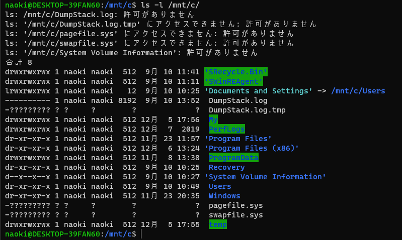
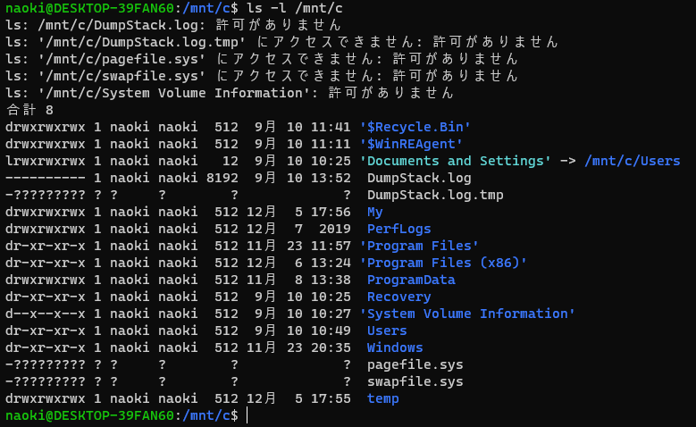

# LS_COLORS の設定を変更する

`WSL` 上からWindowsのディレクトリをみるとディレクトリに背景色が付く


Windowsのディレクトリは `other writable` として認識されてしまっているの原因らしい。

```console
$ echo ${LS_COLORS} | tr ':' '\n' | grep -wE 'di|ow'
di=01;34
ow=34;42
```

* di : Directory
* ow : Directory that is other-writable (o+w) and not sticky

`other writable` のカラー設定を`Directory` と同じ設定する   
※ `.bashrc`  などに追加する
```
$ LS_COLORS="${LS_COLORS}:ow=01;34"
$ export LS_COLORS
```



## 補足

* 文字種類

    | コード | 説明                         |
    | :----- | :--------------------------- |
    | 00     | デフォルトカラーを保存       |
    | 01     | ボールド(明るい色)           |
    | 04     | アンダースコア(下線を付ける) |
    | 05     | ブリンク（点滅する）         |
    | 07     | リバース（反転表示する）     |
    | 08     | 非表示                       |

* 文字色
    | コード | 説明            |
    | :----- | :-------------- |
    | 30     | 黒              |
    | 31     | 赤              |
    | 32     | 緑              |
    | 33     | 黄 (もしくは茶) |
    | 34     | 青              |
    | 35     | 紫              |
    | 36     | シアン          |
    | 37     | 白 (もしくは灰) |

* 背景色
    | コード | 説明            |
    | :----- | :-------------- |
    | 40     | 黒              |
    | 41     | 赤              |
    | 42     | 緑              |
    | 43     | 黄 (もしくは茶) |
    | 44     | 青              |
    | 45     | 紫              |
    | 46     | シアン          |
    | 47     | 白 (もしくは灰) |
